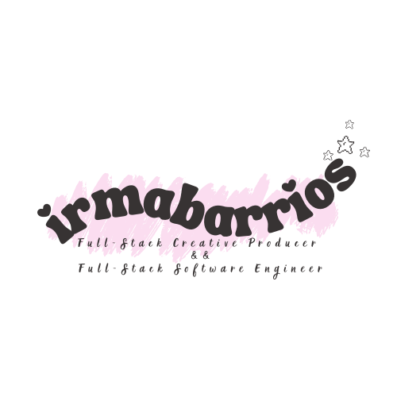

<!-- 🌸 Typing Animation Title -->
<h1 align="center">
  
</h1>

<!-- 🌸 Pastel 8-Bit Banner -->

  

 

<h2 align="center" style="font-family: 'Press Start 2P', cursive; color: #d188a1;">
  🌸 Get to Know Me! 🌸
</h2>

---

## 🎀 About Irma

- 🎮 **Game Dev Enthusiast, Full Stack Developer & Video Artist** based in NYC  
- 🎨 Blending **frontend design**, **video editing**, and **creative storytelling**  
- 💻 Tech Stack: JavaScript · React · PostgreSQL · Node.js  
- ✨ Passionate about crafting **interactive stories**, **immersive UI**, and **cute visuals**  

---
## 🌱 Skill Tree

 
 
 
 
 
 
 
  
  
  

---
## 💖 Top Repositories

  

    
    
Wedding Planner  (React, Node.js, CSS, PostgreSQL, TablePlus, Cloudinary, OpenMeteo)

  

  

    
    
Personal Portfolio  (React, CSS)

  

  

    
    
NYC Food Bank Search  (React, Node.js, CSS, PostgreSQL, TablePlus, Leaflet)

  

  

    
    
Launch Tracker for Sonny Angel, Smiski, Labubu  (JavaScript, HTML, CSS)

  

  

    
    
Garfield-themed Tic Tac Toe  (React, Node.js, CSS)

  

  

    
    
Movie-to-Book Finder  (JavaScript, HTML, CSS, Open Library, TV Maze)

  

  
✨ Click to see more projects planned

  <ul>
Finish Irma.dev portfolio website  
  </ul>
  <ul>
Create a blog page   
  </ul>
  <ul>
Build a fun music player
  </ul>

---

## 🎬 Cutscenes (Video Arts Showcase)

🎥 Minecraft-inspired edits:

 
 

---

## 🎮 Irma Stats

  
  

---

## 📊 Yearly Contributions

  

---
## 🏆 Achievements

  
  

  

--- 

## 📡 Social Links

 
 
 

